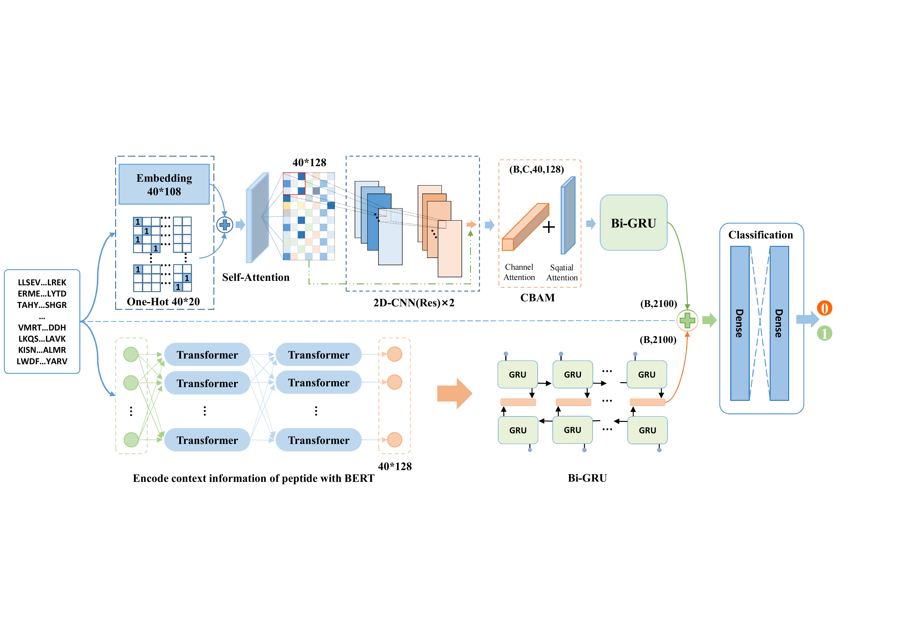

# DeepPD
Deep Learning Model for Predicting Peptide Detectability Based on Multi feature Representation

## Note
1.The data given is the original data that has not been de-redundant by CD-HIT. Users are requested to de-redundant before use.

2.The BERT used in this study is the BERT-Tiny released by Google Research. Please download it by yourself. https://github.com/google-research/bert

## Introduction
Peptide detectability measures the relationship between the protein composition and abundance in the sample to be measured and the peptide detected in the analytical routine, and has important implications for the fundamental tasks of proteomics. Exploring computational methods that can predict peptide detectability with high efficiency and accuracy contributes to the development of proteomics and clinical research. Most of the currently available prediction models consider only some single feature of the sequence, which makes the feature information obtained by the model limited. In order to eliminate this limitation caused by sequence representation, it is necessary to investigate the impact of multi-feature representation on peptide detectability prediction. In this paper, we propose DeepPD, a deep learning method for peptide detectability prediction based on multi-feature representation, which introduces BERT (Bidirectional encoder representations from transformers) to capture the sequence context information and combine both sequence information of peptides to jointly characterize peptide sequences. The experimental results show that the sequence characterization scheme proposed in this paper can fully characterize the information contained in the peptide, and DeepPD can effectively capture the potential abstract discriminative features, which makes the comprehensive performance of DeepPD better than the existing prediction methods. In addition, experimental results show that the model proposed in this paper has strong generalization performance and cross-species prediction capability, which makes DeepPD promising for other protein sequence prediction tasks. 

## Description of relevant files
|Files name |Description |
|-----------|------------|
|data       |Raw data used in this study |
|other models |PepFormer and CapsNet |
|ESM2 | Protein Pretraining Language Model ESM-2 |
|Model.py|DeepPD and Other algorithms involved in this study |
|Biometric_extraction.py |Biometric features used by CapsNet and PD_BertEDL |
|Data_preprocessing.py |Data pre-processing |
|config.py |DeepPD configuration file |
|main.py |Training Script|
|utils.py & utils_etfc.py |Some necessary component units |
|predictor.py |Inference script |
|evaluation.py |evaluating indicator |

## Citation
Not available at the moment.
