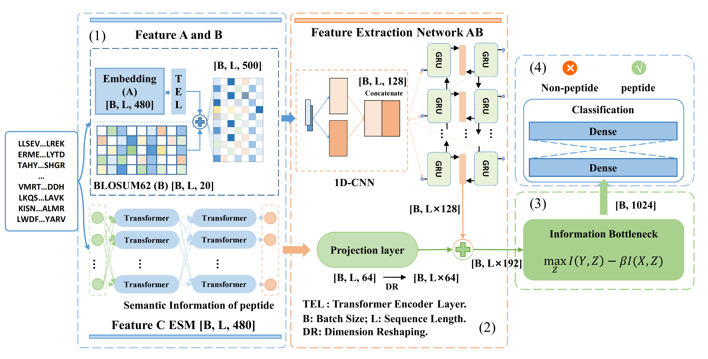

# DeepPD
DeepPD: A Deep Learning Method for Predicting Peptide Detectability Based on Multi-Feature Representation and Information Bottleneck

## Note
1.The data given is the original data that has not been de-redundant by CD-HIT. Users are requested to de-redundant before use.

2.The ESM-2 used in this study is released by Facebook Research. Please download it by yourself. https://github.com/facebookresearch/esm

## Introduction
Peptide detectability measures the relationship between the protein composition and abundance in the sample and the peptides identified during the analytical procedure. This relationship has significant implications for the fundamental tasks of proteomics. Existing methods primarily rely on a single type of feature representation, which limits their ability to capture the intricate and diverse characteristics of peptides. In response to this limitation, we introduce DeepPD, an innovative deep learning framework incorporating multi-feature representation and the Information Bottleneck Principles (IBP) to predict peptide detectability. DeepPD extracts semantic information from peptides using Evolutionary Scale Modeling 2 (ESM-2) and integrates sequence and evolutionary information to construct the feature space collaboratively. The IBP effectively guides the feature learning process, minimizing redundancy in the feature space. Experimental results across various datasets demonstrate that DeepPD outperforms state-of-the-art methods. Furthermore, we demonstrate that DeepPD exhibits competitive generalization and transfer learning capabilities across diverse datasets and species. In conclusion, DeepPD emerges as the most effective method for predicting peptide detectability, showcasing its potential applicability to other protein sequence prediction tasks.

## Description of relevant files
|Files name |Description |
|-----------|------------|
|data       |Raw data used in this study |
|other models |PepFormer and CapsNet |
|Biometric_extraction.py |Biometric features used by CapsNet and PD_BertEDL |
|Data_preprocessing.py |Data pre-processing |
|LossFunction.py | Some loss functions used in this study |
|Model.py|DeepPD and Other algorithms involved in this study |
|config.py |DeepPD configuration file |
|main.py |Training Script|
|utils.py & utils_etfc.py |Some necessary component units |
|predictor.py |Inference script |
|evaluation.py |evaluating indicator |

## Citation
Not available at the moment.
